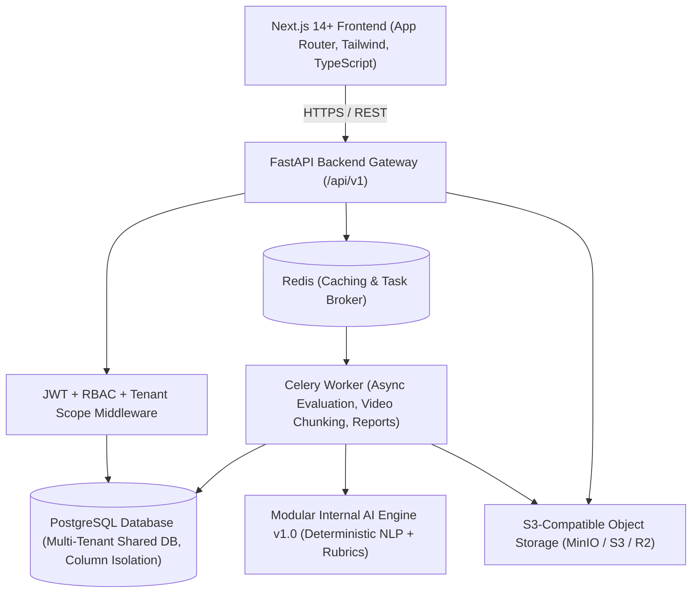

# Ardhnarishwar AI Robotics Interview SaaS Platform

[](#)
[](#)
[](#)
[-ff6f00)](#)
[](#)

A commercial multi-tenant B2B SaaS platform engineered for automated, unbiased technical assessments in robotics, autonomous systems, SLAM, kinematics, and embedded software engineering.

---

## 1. High-Level System Architecture



---

## 2. Key Architecture Highlights

### Strict Multi-Tenant Data Isolation
- **Tenant Scope Enforcement**: Every database query for tenant-owned entities (Jobs, Candidates, Interviews, Questions, Recordings, Reports) enforces `where(Model.tenant_id == current_user.tenant_id)` at the repository and service layer.
- **IDOR Prevention**: Cross-tenant path tampering (e.g. attempting to access another company's records via URL manipulation) is automatically trapped by dependency validators and rejected with a `403 Forbidden` and an immutable security audit alert.

### Internal AI Evaluation Engine (v1.0)
- **Zero Proprietary API Dependency**: Runs completely independently of OpenAI, Gemini, Claude, or Grok.
- **Modular AI Interface**:
  - `QuestionSelector`: Matches job skill requirements with optimal question distribution.
  - `AnswerAnalyzer`: Tokenizes candidate responses, extracts keyword densities, and analyzes verbal clarity.
  - `TechnicalEvaluator`: Computes topic and skill coverage ratios against domain rubrics (Kinematics, SLAM, ROS2, Real-Time C++).
  - `BehavioralEvaluator`: Assesses STAR (Situation, Task, Action, Result) personal impact indicators.
  - `CommunicationEvaluator`: Measures sentence structure and filler-word density.
  - `CompetencyScorer`: Applies configurable interview scoring weights to generate composite recommendations (`STRONG_HIRE`, `HIRE`, `CONSIDER`, `REJECT`).
  - `ReportGenerator`: Synthesizes evaluation summaries and outputs downloadable candidate PDF reports.

### Security & Compliance
- **Password Hashing**: State-of-the-art **Argon2id** hashing via `passlib`.
- **Authentication**: Short-lived JWT Access Tokens (15 mins) and rotatable Refresh Tokens (7 days).
- **Cryptographic Single-Use Invitation Tokens**: Interview links are single-use, expirable, and cryptographically unpredictable.
- **Signed Storage URLs**: Video and audio recordings are stored privately in S3/MinIO and streamed via HMAC-signed temporary URLs.

---

## 3. Seed Accounts & Demo Credentials

The platform seeds a Super Admin and two isolated robotics company tenants out of the box:

| Role | Email | Password | Scope |
|---|---|---|---|
| **Super Admin** | `admin@ardhnarishwar.ai` | `AdminSecurePassword123!` | Platform-wide Control Plane, Datasets, Audit Logs |
| **Tenant A Recruiter** | `recruiter@apexrobotics.io` | `ApexSecurePass2026!` | Apex Robotics Inc Workspace |
| **Tenant B Recruiter** | `recruiter@bostoncyber.com` | `BostonSecurePass2026!` | Boston Cybernetics Workspace |

*Demo Candidate Token for live candidate interview experience:*  
`/candidate/interview/apex-demo-token-marcus-vance-2026`

---

## 4. Local Quickstart Guide

### Prerequisites
- Python 3.11+
- Node.js 18+ and npm
- (Optional) Docker & Docker Compose

### Option A: Running with Docker Compose (One-Command)
```bash
docker compose up --build
```
- **Frontend**: `http://localhost:3000`
- **Backend API**: `http://localhost:8000/api/v1`
- **Interactive Swagger Docs**: `http://localhost:8000/api/v1/docs`

---

### Option B: Running Locally

#### 1. Backend Setup
```bash
# From workspace root
pip install -r backend/requirements.txt
pip install email-validator aiofiles

# Run FastAPI backend server
python -m uvicorn backend.app.main:app --host 0.0.0.0 --port 8000 --reload
```

#### 2. Frontend Setup
```bash
cd frontend
npm install
npm run dev
```

Visit `http://localhost:3000` to launch the platform.

---

## 5. Automated Test Suite

Run the automated test suite verifying tenant isolation, RBAC boundaries, and AI scoring:

```bash
python -m pytest backend/tests -o pythonpath=backend -v
```

### Verified Test Cases:
1. `test_tenant_data_isolation`: Proves that Company A cannot read or access Company B's jobs or candidate recordings.
2. `test_rbac_super_admin_protection`: Verifies that recruiters cannot perform Super Admin actions.
3. `test_super_admin_access`: Verifies platform telemetry and company provisioning access.
4. `test_internal_ai_evaluation_scoring`: Tests deterministic topic coverage and technical rubric scoring.
5. `test_full_interview_lifecycle`: Full E2E verification from job creation, candidate invitation, single-use token verification, answer submission, AI evaluation scoring, to recruiter shortlisting.

---

## 6. Project Structure

```
.
├── backend/
│   ├── app/
│   │   ├── ai/               # Modular Internal AI Engine v1.0
│   │   ├── api/v1/           # Versioned REST Endpoints (Auth, Admin, Jobs, Interviews, Reports...)
│   │   ├── core/             # Configuration, Database Engine, Security & JWT
│   │   ├── db/               # Bootstrap & Seed Initializer
│   │   ├── models/           # SQLAlchemy 2.0 ORM Normalized Models
│   │   ├── repositories/     # Tenant-Scoped Data Access Repositories
│   │   ├── schemas/          # Pydantic v2 Request & Response Schemas
│   │   ├── services/         # Domain Business Logic
│   │   ├── storage/          # S3 / MinIO / Local Storage Service Abstraction
│   │   └── workers/          # Celery Async Background Tasks
│   ├── tests/                # Automated Pytest Suite
│   └── requirements.txt
├── frontend/
│   ├── app/
│   │   ├── (auth)/login/     # Interactive Login Portal with autofill presets
│   │   ├── admin/            # Super Admin Platform Dashboard
│   │   ├── company/          # Tenant Company Admin Workspace
│   │   ├── candidate/        # Distraction-Free Interview UI
│   │   ├── page.tsx          # Public Landing Page
│   │   └── layout.tsx
│   ├── components/           # UI & Navigation Components
│   ├── lib/                  # Type-Safe API Client & Utilities
│   └── package.json
├── docker-compose.yml
├── .env.example
└── README.md
```
Live Link:https://recruweb-ai-interview-k2tq1zk8u-vyapar2.vercel.app/
